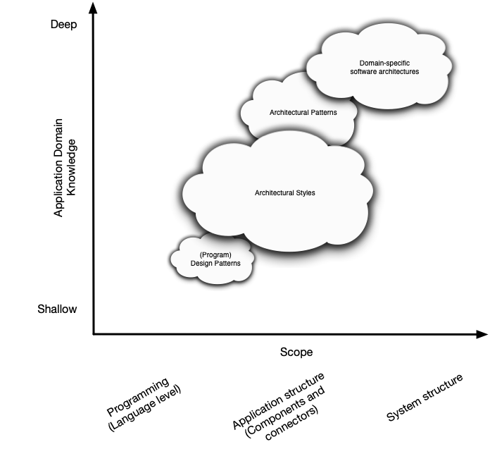

# CPSC-5200-01 Software Architecture and Design Assignment #2

Please write a short (no less than one page and no more than five pages) paper discussing the primary differences, as you see them, between _Architectural Style_ and _Architectural Pattern_. As we discussed in class earlier in the quarter, there is a relationship between these concepts. Over this quarter you have been introduced to _Language Idioms_ and the start of _Design Patterns_. Keep these new details in mind and remember the picture I drew on the whiteboard.

This assignment is due before class on 20-Feb and is worth 5 points.
